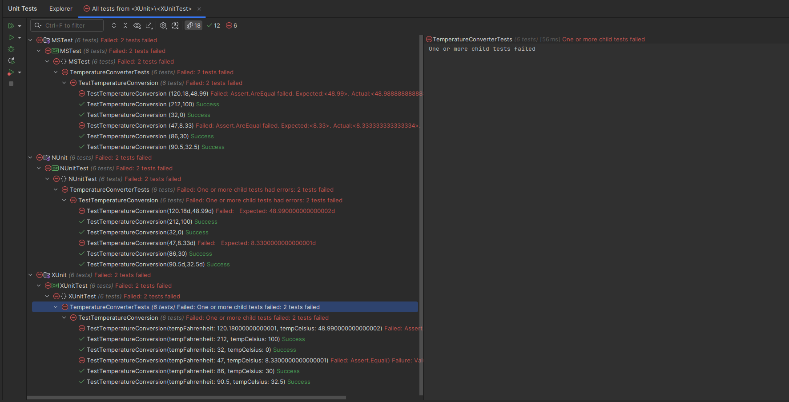

# xunit-nunit-mstest

## Tecnologias utilizadas
Neste projeto, foram utilizados três frameworks populares para a realização de testes unitários em aplicações .NET:

- XUnit: Um framework de testes open-source para .NET, focado em ser extensível e fácil de usar. É conhecido pela simplicidade de sua sintaxe e pelo suporte nativo ao paralelismo.

- NUnit: Outro framework de testes open-source que oferece uma sintaxe expressiva e extensibilidade. É amplamente utilizado na comunidade .NET e possui uma longa história de desenvolvimento.

- MSTest: O framework de testes oficial da Microsoft, integrado ao Visual Studio. Ele oferece uma abordagem familiar para desenvolvedores que utilizam o ecossistema Microsoft.

## 1. Criação da estrutura do projeto

**1.1. Criação de uma solução vazia**

Para começar, foi criada uma solução vazia onde serão adicionados os diferentes projetos de testes.

<p align="center">

</p>

**1.2. Criação das soluções dos testes**

Em seguida, foram criadas soluções específicas para cada framework de testes(XUnit, NUnit e MSTest).

<p align="center">

</p>

**1.3. Criação dos projetos dos testes**

Dentro de cada solução de testes, foram adicionados os projetos correspondentes aos frameworks de testes.

<p align="center">

</p>

**1.4. Resultado da estrutura do projeto**

A estrutura final do projeto deve ter um projeto principal e três projetos de testes, cada um usando um framework diferente e dentro de três diferentes soluções.

<p align="center">

</p>

## 2. Criação das classes

**2.1. Criação da classe TemperatureConverter**

Foi criada uma classe chamada TemperatureConverter no projeto principal, que contém o método FahrenheitToCelsius para converter temperaturas de Fahrenheit para Celsius.

```csharp
namespace Temp
{
    public static class TemperatureConverter
    {
        public static double FahrenheitToCelsius(double temperature)
            //=> (temperature - 32) / 1.8; // Simulação de falha
            => Math.Round((temperature - 32) / 1.8, 2);
    }
}
```

O resultado na IDE foi o seguinte:

<p align="center">

</p>

**2.2. Criação da classe TemperatureConverterTests no projeto XUnit**

No projeto XUnit, foi criada a classe de testes TemperatureConverterTests para verificar a conversão de temperaturas por meio da definição de 6 casos de teste.


```csharp
namespace XUnitTest;

public class TemperatureConverterTests
{
    [Theory]
    [InlineData(32, 0)]
    [InlineData(47, 8.33)]
    [InlineData(86, 30)]
    [InlineData(90.5, 32.5)]
    [InlineData(120.18, 48.99)]
    [InlineData(212, 100)]
    public void TestTemperatureConversion(
        double tempFahrenheit, double tempCelsius)
    {
        double calculated =
            Temp.TemperatureConverter.FahrenheitToCelsius(tempFahrenheit);
        Assert.Equal(tempCelsius, calculated);
    }
}
```

O resultado na IDE foi o seguinte:

<p align="center">

</p>

**2.3. Criação da classe TemperatureConverterTests no projeto NUnit**

Para o projeto NUnit, foi criada a classe de testes TemperatureConverterTests com casos de teste similares.

```csharp
namespace NUnitTest;

public class TemperatureConverterTests
{
    [TestCase(32, 0)]
    [TestCase(47, 8.33)]
    [TestCase(86, 30)]
    [TestCase(90.5, 32.5)]
    [TestCase(120.18, 48.99)]
    [TestCase(212, 100)]
    public void TestTemperatureConversion(
        double tempFahrenheit, double tempCelsius)
    {
        double valorCalculado =
            Temp.TemperatureConverter.FahrenheitToCelsius(tempFahrenheit);
        Assert.AreEqual(tempCelsius, valorCalculado);
    }
}
```

O resultado na IDE foi o seguinte:

<p align="center">

</p>

**2.4. Criação da classe TemperatureConverterTests no projeto MSTest**

No projeto MSTest, foi criada a classe TemperatureConverterTests também com os mesmos casos de teste.

```csharp
namespace MSTest;

[TestClass]
public class TemperatureConverterTests
{
    [DataRow(32, 0)]
    [DataRow(47, 8.33)]
    [DataRow(86, 30)]
    [DataRow(90.5, 32.5)]
    [DataRow(120.18, 48.99)]
    [DataRow(212, 100)]
    [DataTestMethod]
    public void TestTemperatureConversion(
        double tempFahrenheit, double tempCelsius)
    {
        double calculated =
            Temp.TemperatureConverter.FahrenheitToCelsius(tempFahrenheit);
        Assert.AreEqual(tempCelsius, calculated);
    }
}
```

O resultado na IDE foi o seguinte:

<p align="center">

</p>

**2.5. Referenciando o projeto Temp nos projetos de teste**

Os projetos de teste foram configurados para referenciar o projeto principal Temp, garantindo que os testes possam acessar a classe TemperatureConverter.

<p align="center">

</p>

<p align="center">

</p>

## 3. Execução dos testes

**3.1. Como executar um projeto de testes**

Os testes podem ser executados utilizando o Test Explorer do Visual Studio/Rider clicando com o botão direito no projeto de testes que deseja executar, que foi o meu caso, ou através do comando `dotnet test` da CLI.

<p align="center">

</p>

**3.2. Execução dos testes do projeto XUnit**

A imagem abaixo mostra a execução dos testes do projeto xUnit. Todos os testes foram bem-sucedidos, indicando que o método FahrenheitToCelsius da classe TemperatureConverter funcionou corretamente para os casos de teste fornecidos.

<p align="center">

</p>

- Testes Realizados: Seis testes unitários foram realizados, cada um verificando a conversão de uma temperatura específica de Fahrenheit para Celsius.
- Comportamento: Para cada valor de entrada (temperatura em Fahrenheit), o teste verifica se a saída (temperatura em Celsius) está correta.
- Resultados: Todos os testes passaram com sucesso, o que significa que as conversões foram precisas dentro do nível de precisão esperado (duas casas decimais).
- Sucesso: Os valores calculados pela função FahrenheitToCelsius corresponderam exatamente aos valores esperados especificados nos atributos InlineData.

**3.3. Execução dos testes do projeto NUnit**

A imagem abaixo mostra a execução dos testes do projeto NUnit. Similar aos testes com xUnit, todos os testes do NUnit foram bem-sucedidos, validando a funcionalidade da conversão de temperatura.

<p align="center">

</p>

- Testes Realizados: Seis testes unitários foram realizados, cada um verificando a conversão de uma temperatura específica de Fahrenheit para Celsius.
- Comportamento: Assim como no xUnit, os testes verificam se a função FahrenheitToCelsius converte corretamente os valores de entrada para os valores de saída esperados.
- Resultados: Todos os testes passaram com sucesso, confirmando que as conversões foram precisas.
- Sucesso: O sucesso dos testes indica que o método FahrenheitToCelsius está corretamente implementado e retorna resultados precisos para os casos de teste.

**3.4. Execução dos testes do projeto MSTest**

A imagem abaixo mostra a execução dos testes do projeto MSTest. Assim como nos frameworks anteriores, todos os testes do MSTest foram bem-sucedidos.

<p align="center">

</p>

- Testes Realizados: Seis testes unitários foram realizados, verificando a conversão de diferentes temperaturas de Fahrenheit para Celsius.
- Comportamento: Os testes seguem a mesma lógica dos outros frameworks, validando se a função FahrenheitToCelsius retorna os valores corretos de Celsius para as entradas em Fahrenheit.
- Resultados: Todos os testes passaram com sucesso, demonstrando a precisão e a robustez da implementação do método de conversão.
- Sucesso: A aprovação dos testes confirma que o método FahrenheitToCelsius é confiável e cumpre sua função conforme esperado.

**3.5 Simulando caso de falha**

Nessa etapa, o código da classe TemperatureConverter foi alterado para o seguinte:

```csharp
namespace Temp
{
    public static class TemperatureConverter
    {
        public static double FahrenheitToCelsius(double temperature)
            => (temperature - 32) / 1.8; // Simulação de falha
            //=> Math.Round((temperature - 32) / 1.8, 2);
    }
}
```

Essa alteração é suficiente para simular a falha em alguns testes, já que remove o arredondamento no resultado do cálculo da conversão.

Nesse sentido, os resultados foram o seguinte:

<p align="center">

</p>

A falha ocorreu em dois dos testes em todas as classes.
- XUnit: Esperava que o resultado do cálculo fosse igual a 48.990000000000002 e 8.3300000000000001 e recebeu 48.988888888888894 e 8.3333333333333339. Os valores esperados e recebidos são diferentes.
- NUnit: Esperava 48.990000000000002d e 8.3300000000000001d e recebeu 48.988888888888894d e 8.3333333333333339d
- MSTest: Esperava os valores arredondados 48.99 e 8.33 e recebeu 48.988888888888894 e 8.333333333333334. Os valores esperados e recebidos são diferentes.

Isso reforça que as asserções de igualdade e de input de valores no caso de teste são diferentes para cada Framework.

## Conclusão
Neste projeto, foram demonstrados os processos de configuração e execução de testes unitários utilizando três dos frameworks de teste mais populares para .NET: xUnit, NUnit e MSTest. Cada framework tem suas próprias características e vantagens, e a escolha entre eles pode depender de preferências pessoais, requisitos específicos do projeto ou do ecossistema de ferramentas em uso.

## Conceitos Aprendidos

1. Estruturação de Projetos de Teste:

- Organização da Solução: Criação de uma solução com múltiplos projetos de teste, cada um utilizando um framework de teste diferente (xUnit, NUnit, MSTest). Essa abordagem ajuda a comparar diferentes frameworks, mas também garante uma estrutura modular e bem-organizada para os testes.

- Referenciamento de Projetos: Como referenciar o projeto principal (Temp) nos projetos de teste, assegurando que os testes tenham acesso às classes e métodos que precisam verificar.

2. Implementação de Testes Unitários:

- Escrita de Testes: Testes unitários utilizando três frameworks populares: xUnit, NUnit e MSTest. Cada framework tem sua própria sintaxe e conjunto de atributos, mas todos compartilham o objetivo comum de verificar a funcionalidade do código de forma automática e consistente.

- Atributos de Teste: Uso de atributos como [Theory] e [InlineData] no xUnit, [TestCase] no NUnit, e [DataTestMethod] e [DataRow] no MSTest para definir diferentes casos de teste, proporcionando uma cobertura completa das variações de entrada.

3. Execução e Integração de Testes:

- Execução no Visual Studio: Como usar o Test Explorer do Rider para gerenciar e executar testes.

- Diagnóstico de Falhas: A simulação de falhas nos testes demonstrou como utilizar as ferramentas de teste para identificar e diagnosticar problemas no código, pois foi possível observar diferenças na precisão dos resultados (devido à remoção do arredondamento) podem causar falhas nos testes.
