# xunit-nunit-mstest

## Tecnologias utilizadas
Neste projeto, foram utilizados três frameworks populares para a realização de testes unitários em aplicações .NET:

- XUnit: Um framework de testes open-source para .NET, focado em ser extensível e fácil de usar. É conhecido pela simplicidade de sua sintaxe e pelo suporte nativo ao paralelismo.

- NUnit: Outro framework de testes open-source que oferece uma sintaxe expressiva e extensibilidade. É amplamente utilizado na comunidade .NET e possui uma longa história de desenvolvimento.

- MSTest: O framework de testes oficial da Microsoft, integrado ao Visual Studio. Ele oferece uma abordagem familiar para desenvolvedores que utilizam o ecossistema Microsoft.

## 1. Criação da estrutura do projeto

**1.1. Criação de uma solução vazia**

Para começar, foi criada uma solução vazia onde serão adicionados os diferentes projetos de testes.

<p align="center">
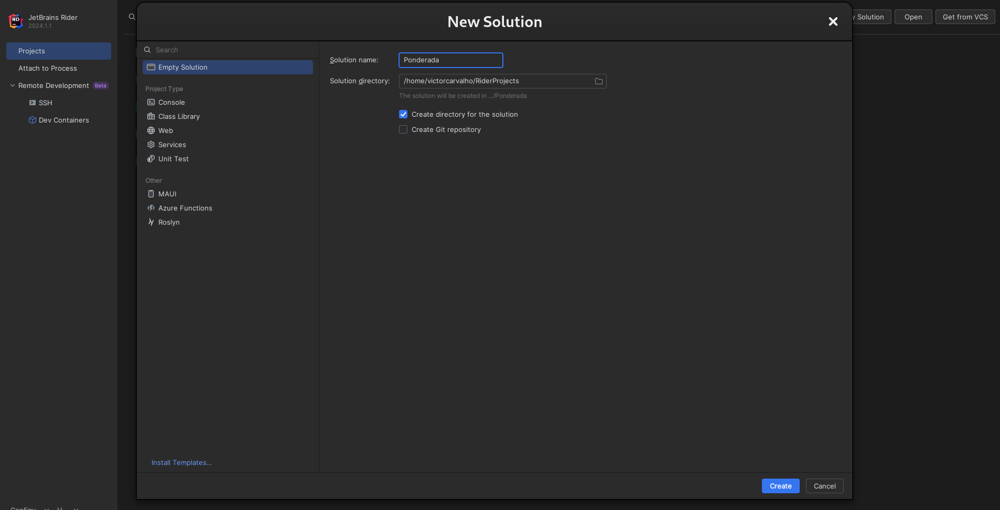
</p>

**1.2. Criação das soluções dos testes**

Em seguida, foram criadas soluções específicas para cada framework de testes(XUnit, NUnit e MSTest).

<p align="center">
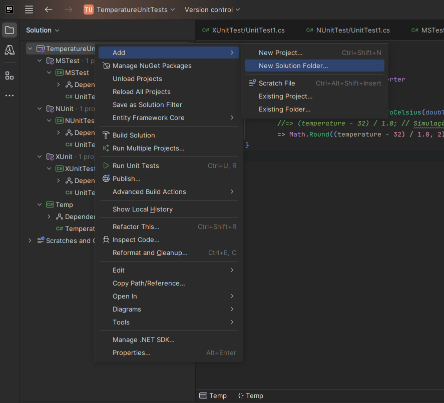
</p>

**1.3. Criação dos projetos dos testes**

Dentro de cada solução de testes, foram adicionados os projetos correspondentes aos frameworks de testes.

<p align="center">
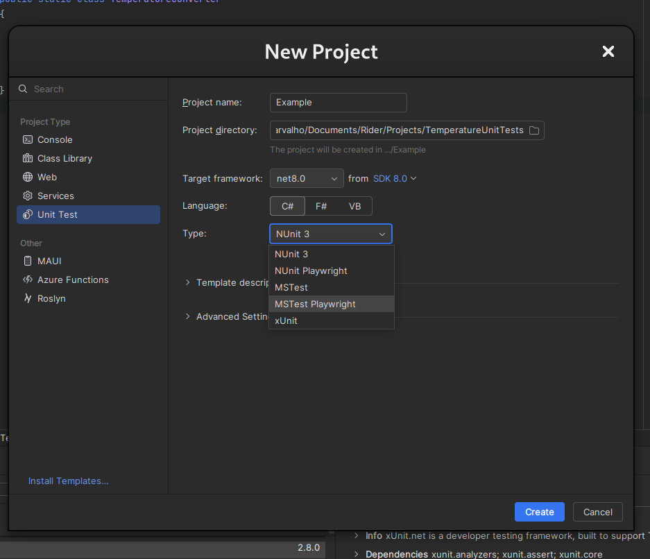
</p>

**1.4. Resultado da estrutura do projeto**

A estrutura final do projeto deve ter um projeto principal e três projetos de testes, cada um usando um framework diferente e dentro de três diferentes soluções.

<p align="center">
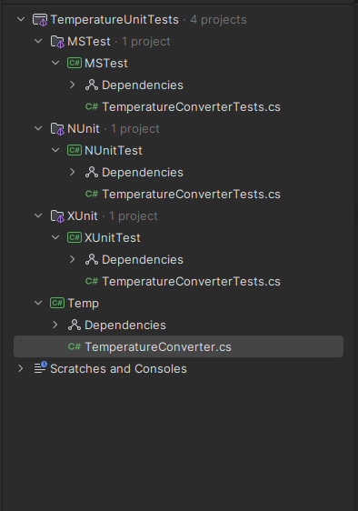
</p>

## 2. Criação das classes

**2.1. Criação da classe TemperatureConverter**

Foi criada uma classe chamada TemperatureConverter no projeto principal, que contém o método FahrenheitToCelsius para converter temperaturas de Fahrenheit para Celsius.

```csharp
namespace Temp
{
    public static class TemperatureConverter
    {
        public static double FahrenheitToCelsius(double temperature)
            //=> (temperature - 32) / 1.8; // Simulação de falha
            => Math.Round((temperature - 32) / 1.8, 2);
    }
}
```

O resultado na IDE foi o seguinte:

<p align="center">
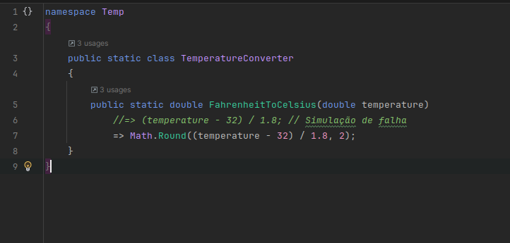
</p>

**2.2. Criação da classe TemperatureConverterTests no projeto XUnit**

No projeto XUnit, foi criada a classe de testes TemperatureConverterTests para verificar a conversão de temperaturas.


```csharp
namespace XUnitTest;

public class TemperatureConverterTests
{
    [Theory]
    [InlineData(32, 0)]
    [InlineData(47, 8.33)]
    [InlineData(86, 30)]
    [InlineData(90.5, 32.5)]
    [InlineData(120.18, 48.99)]
    [InlineData(212, 100)]
    public void TestTemperatureConversion(
        double tempFahrenheit, double tempCelsius)
    {
        double calculated =
            Temp.TemperatureConverter.FahrenheitToCelsius(tempFahrenheit);
        Assert.Equal(tempCelsius, calculated);
    }
}
```

O resultado na IDE foi o seguinte:

<p align="center">
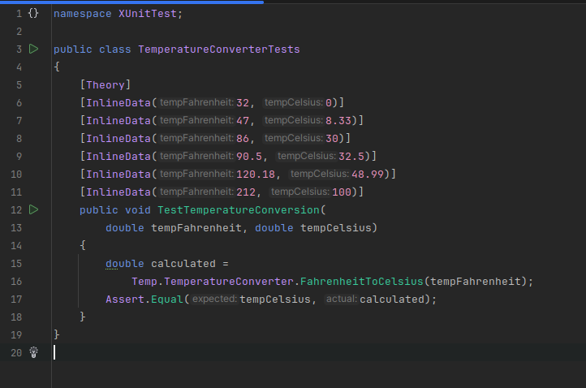
</p>

**2.3. Criação da classe TemperatureConverterTests no projeto NUnit**

Para o projeto NUnit, foi criada a classe de testes TemperatureConverterTests com casos de teste similares.

```csharp
namespace NUnitTest;

public class TemperatureConverterTests
{
    [TestCase(32, 0)]
    [TestCase(47, 8.33)]
    [TestCase(86, 30)]
    [TestCase(90.5, 32.5)]
    [TestCase(120.18, 48.99)]
    [TestCase(212, 100)]
    public void TestTemperatureConversion(
        double tempFahrenheit, double tempCelsius)
    {
        double valorCalculado =
            Temp.TemperatureConverter.FahrenheitToCelsius(tempFahrenheit);
        Assert.AreEqual(tempCelsius, valorCalculado);
    }
}
```

O resultado na IDE foi o seguinte:

<p align="center">
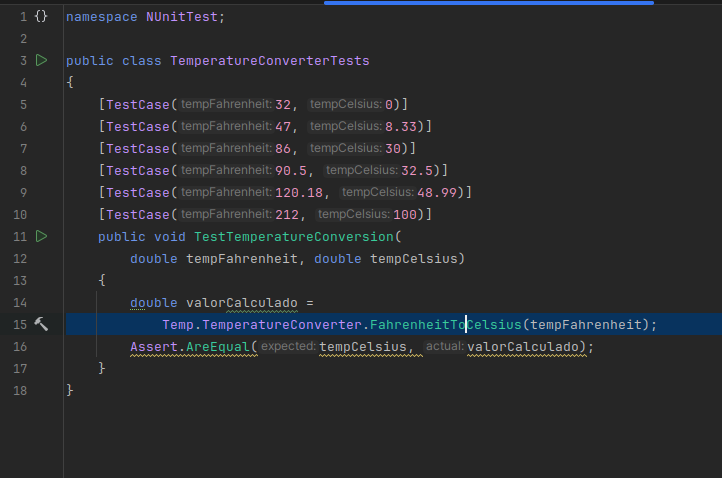
</p>

**2.4. Criação da classe TemperatureConverterTests no projeto MSTest**

No projeto MSTest, foi criada a classe TemperatureConverterTests também com os mesmos casos de teste.

```csharp
namespace MSTest;

[TestClass]
public class TemperatureConverterTests
{
    [DataRow(32, 0)]
    [DataRow(47, 8.33)]
    [DataRow(86, 30)]
    [DataRow(90.5, 32.5)]
    [DataRow(120.18, 48.99)]
    [DataRow(212, 100)]
    [DataTestMethod]
    public void TestTemperatureConversion(
        double tempFahrenheit, double tempCelsius)
    {
        double calculated =
            Temp.TemperatureConverter.FahrenheitToCelsius(tempFahrenheit);
        Assert.AreEqual(tempCelsius, calculated);
    }
}
```

O resultado na IDE foi o seguinte:

<p align="center">
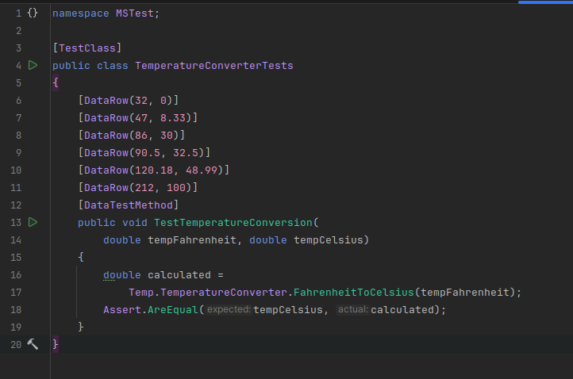
</p>

**2.5. Referenciando o projeto Temp nos projetos de teste**

<p align="center">
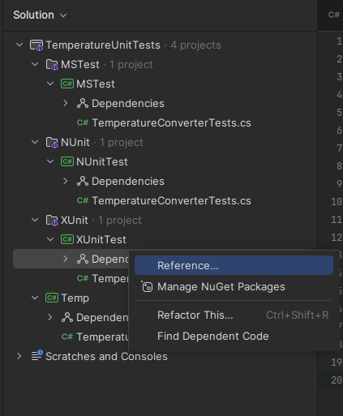
</p>

<p align="center">
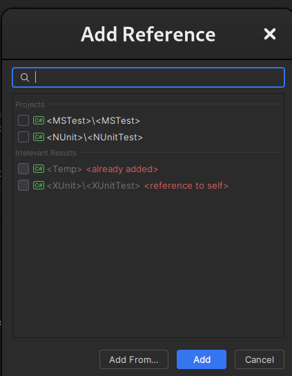
</p>

## 3. Execução dos testes

**3.1. Como executar um projeto de testes**

<p align="center">
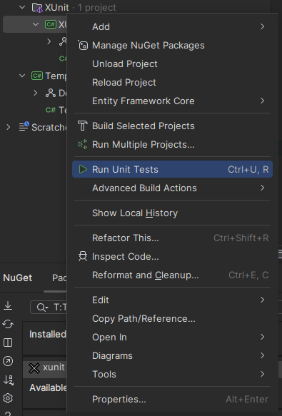
</p>

**3.2. Execução dos testes do projeto XUnit**

<p align="center">
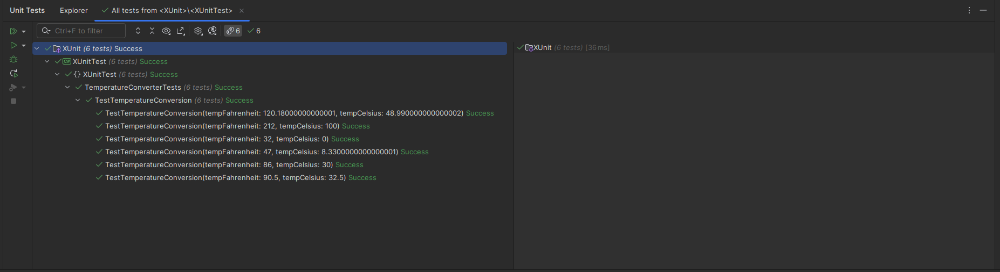
</p>

**3.3. Execução dos testes do projeto NUnit**

<p align="center">
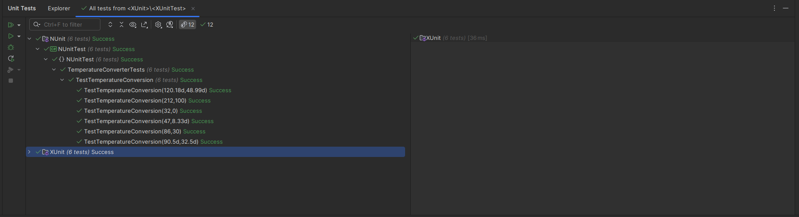
</p>

**3.3. Execução dos testes do projeto MSTest**

<p align="center">
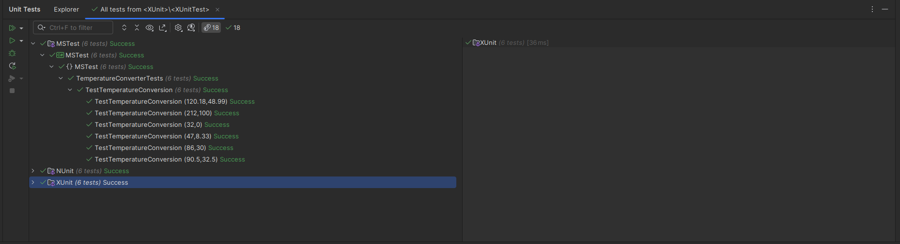
</p>

## Conclusão

## Conceitos Aprendidos